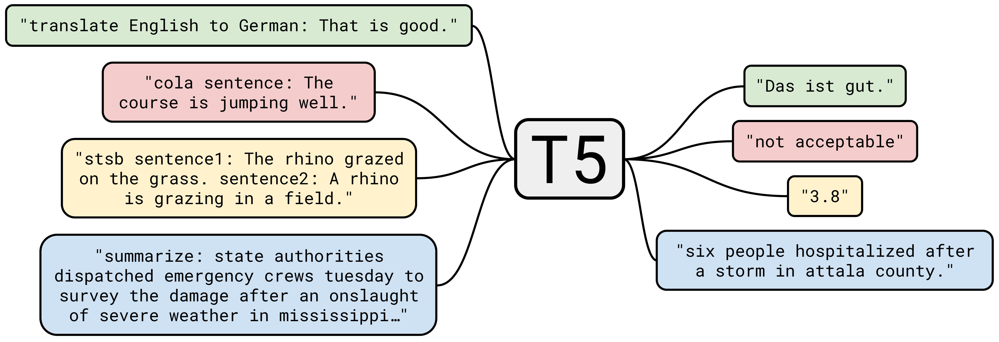

# Attempting to run T5 using ONNX Runtime Web

For an initial MVP the team wanted to run a summarisation model. This would enable users to upload documents (.txt) 
and receive a basic summary of the text.

To do so, the team had a look at the [ONNX Model Zoo GitHub repo](https://github.com/onnx/models) to look for suitable
models. Under [machine comprehension](https://github.com/onnx/models?tab=readme-ov-file#machine_comprehension), the T5
model seemed to be a good choice. 

T5 is a relatively lightweight text model that supports various tasks: sentiment-analysis, question-answering,
similarity-detection, translation, summarisation, and more.



Hence, the team aimed to get this working to reach the MVP.

## Running the Model

T5 consists of an encoder and decoder. However, when downloaded off of the model zoo, it was noticed that the 
input/output layer names of the encoder and decoder did not match with the T5 documentation.

Hence, the models were then sourced from HuggingFace https://huggingface.co/onnx-community/t5-base-ONNX/tree/main/onnx

The team attempted to run the encoder and decoder models, however, unfortunately were not able to get it working by 
the end of the first sprint review. The code can be seen below:

package.json
```json
{
  "dependencies": {
    "onnxruntime-web": "^1.21.0",
    "tokenizers": "^0.13.3",
    "tokenizers-linux-x64-gnu": "^0.13.4-rc1"
  }
}
```

inference.js
```js
import { Tokenizer } from "tokenizers";
import * as ort from 'onnxruntime-web';


function softmax(logits) {
    const exps = logits.map(l => Math.exp(l)); // Exponentiate each logit
    const sum = exps.reduce((a, b) => a + b, 0); // Sum of all exponentiated logits
    return exps.map(exp => exp / sum); // Normalize to get probabilities
}

/**
 * Inference some text with the T5 model https://huggingface.co/onnx-community/t5-base-ONNX/tree/main/onnx
 * @param {string} text the text to be ran through the T5 model
 * @return {string} T5's response
 */
async function inferenceT5(text) {

    console.log("\n\nInput text:", text);

    // tokenizing the input text
    let tokenizer = await Tokenizer.fromPretrained('t5-base');
    // let tokenizer = await Tokenizer.fromFile("tokenizer.json");
    let encodedText = await tokenizer.encode(text);

    console.log("Input IDs:", encodedText.getIds());
    console.log("Attention Mask:", encodedText.getAttentionMask());

    // load the models
    let encoderSession = await ort.InferenceSession.create("encoder_model.onnx");
    let decoderSession = await ort.InferenceSession.create("decoder_model.onnx");

    console.log("Encoder input names:", encoderSession.inputNames)
    console.log("Encoder output names:", encoderSession.outputNames)
    console.log("Decoder input names:", decoderSession.inputNames)
    console.log("Decoder output names:", decoderSession.outputNames)

    // prepare the encoder input tensor
    let inputIdsArr = encodedText.getIds();
    let inputIdsTensor = new ort.Tensor('int64', inputIdsArr, [1, inputIdsArr.length]);

    let attentionMask = encodedText.getAttentionMask();
    let attentionMaskTensor = new ort.Tensor('int64', attentionMask, [1, attentionMask.length]);

    let encoderFeed = { input_ids: inputIdsTensor, attention_mask: attentionMaskTensor };

    // run encoder inference
    let encoderOutput = await encoderSession.run(encoderFeed);
    console.log("Encoder Output:", encoderOutput)

    // prepare the decoder input tensor
    let decoderFeed = { encoder_attention_mask: attentionMaskTensor, input_ids: inputIdsTensor, 
        encoder_hidden_states: encoderOutput.last_hidden_state }

    // run decoder inference
    let decoderOutput = await decoderSession.run(decoderFeed);
    console.log("Decoder Output logits:", decoderOutput.logits);

    // convert decoder output into text
    let sequenceLength = decoderOutput.logits.dims[1];
    let vocabSize = decoderOutput.logits.dims[2];

    console.log("Sequence Length:", sequenceLength);
    console.log("Vocab Size:", vocabSize);

    let decodedSequence = [];

    for (let t=0; t < sequenceLength; t++) {
        let logitsAtT = decoderOutput.logits.data.slice(t*vocabSize, (t+1)*vocabSize);
        let probabilities = softmax(logitsAtT);
        let predictedTokenIndex = probabilities.indexOf(Math.max(...probabilities));
        decodedSequence.push(predictedTokenIndex);
    }

    // for (let t=0; t < sequenceLength; t++) {
    //     let logitAtT = decoderOutput.logits.data.slice(t*vocabSize, (t+1)*vocabSize);
    //     let predictedTokenIndex = logitAtT.indexOf(Math.max(...logitAtT));
    //     decodedSequence.push(predictedTokenIndex);
    // }
    console.log("Decoded Sequence (token indices):", decodedSequence);

    let textOutput = await tokenizer.decode(decodedSequence, true);
    console.log("Generated Text:", textOutput);

    return textOutput;
}


let text = "translate English to French: I was a victim of a series of accidents.";
inferenceT5(text);
// should output: "J'ai été victime d'une série d'accidents."
// however, currently outputs: "traduc traduc German   German .   a of  ?"
```
